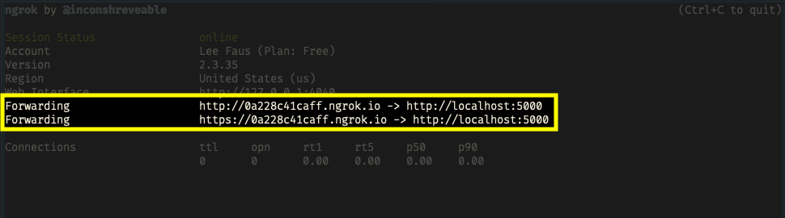
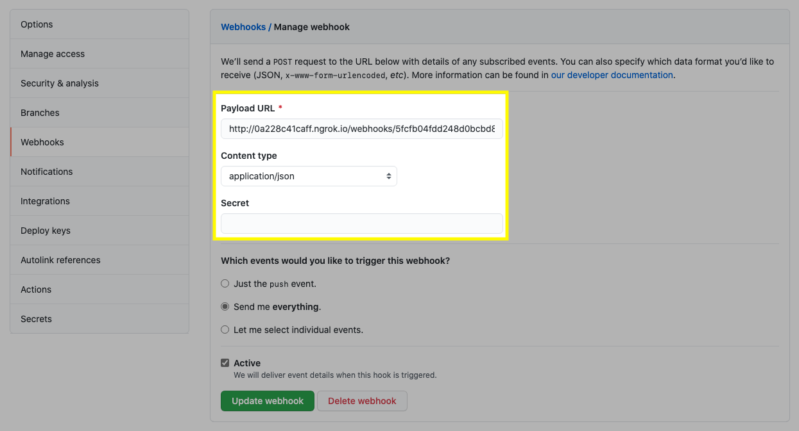

## Cockpit 
### The ultimate continuous delivery demonstration
---
## Pre-requisites
```bash
> $ /bin/bash -c "$(curl -fsSL https://raw.githubusercontent.com/Homebrew/install/HEAD/install.sh)"
> $ brew cask install docker
> $ brew install node
> $ brew install yarn
> $ brew cask install ngrok
```
## Setup
We will be using a [MERN](https://www.educative.io/edpresso/what-is-mern-stack) stack for quick prototyping to test out our hypothesis.
### Database setup

Let's start by initializing a MongoDB database into our $HOME directory and using Docker as the engine to run our container.

```bash
> $ mkdir ~/mongo-data
> $ docker run --name cockpit -v ~/mongo-data:/data/db -p 27017:27017 -d mongo
```
### Clone the Cockpit repository
```bash
> $ git clone https://github.com/armory/cockpit.git
```
### Install the dependencies
```bash
> $ cd cockpit
> $ yarn install
```

### Run Cockpit
```bash
> $ cd cockpit
> $ npm run dev
```

### Testing Webhook Events
```bash
> $ ngrok http 5000
```
- Take the **Forwarding** URL and add it to a Webhook in GitHub



Payload format: <br/>
`http://:ngrok_url/webhooks/:application_id/:webhook_type`

Example Payload URL: <br/>
`http://0a228c41caff.ngrok.io/webhooks/5fcfb04fdd248d0bcbd8c356/github`

